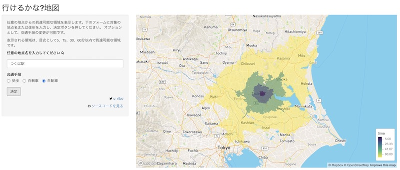

行けるかな?地図
====================



## 必要なもの

- R実行環境
- Mapbox API Token

```r
shiny::runGitHub("shinyapps", "uribo", subdir = "mapbox_isochrone")
```

## 利用したShiny関連パッケージ

- [fontawesome](https://github.com/rstudio/fontawesome) ... FontAwesomeアイコンの利用
- [mapdeck](https://github.com/SymbolixAU/mapdeck) ... 地図
    - ジオコーディング及びisochrone APIはmapboxapiパッケージを通してリクエスト 
- [waiter](https://github.com/JohnCoene/waiter) ... ページ読み込み画面

